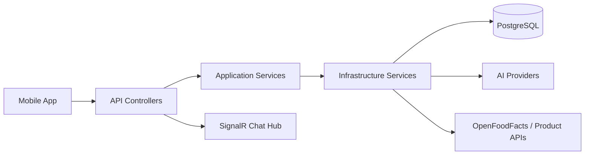
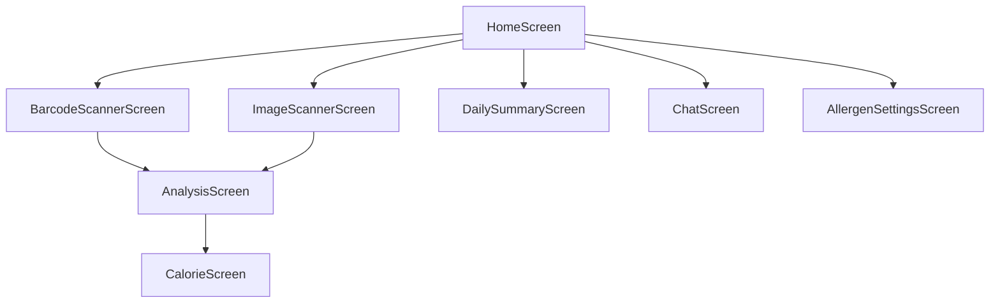

# EatWell / FeelWell

<div align="center">
  
  <br />
  <br />
  <p><strong>Akilli beslenme takibi, barkod tarama, gorsel analiz ve alerjen odakli yonetim tek bir mobil uygulamada.</strong></p>
  <p>
    
    
    
    
  </p>
</div>

EatWell, manuel kalori girisini azaltmak icin tasarlanmis bir mobil beslenme asistanidir. Kullanici barkod tarayabilir, yemegin fotografini yukleyebilir, gunluk ozetini gorebilir, alerjenlerini tanimlayabilir ve AI destekli beslenme tavsiyesi alabilir.

## Proje Ozeti

- Barkod tarama ve urun arama
- Gorsel yemek analizi
- Alerjen bazli uyarilar
- Gunluk kalori ve makro takibi
- AI sohbet asistani
- Expo tabanli mobil istemci
- .NET 9 uzerinde katmanli backend

## Mimari

Proje temiz bir katman yapisina ayrilmis durumda:

- **API**: HTTP endpoint'leri, middleware, SignalR hub ve Swagger
- **Core / Domain**: temel entity'ler ve is kurallari
- **Core / Application**: service kontratlari, DTO'lar, repository arayuzleri
- **Infrastructure**: AI servisleri, is servisleri ve dis servis baglantilari
- **Persistence**: Entity Framework Core, Identity ve veritabani baglantisi
- **Mobil**: Expo/React Native ekranlari, servisleri ve UI bilesenleri



### Backend Akisi

- `FoodAnalysisController` barkod ve gorsel analizini yonetir.
- `AiChatController` kullanicinin beslenme sorularini cevaplar.
- `DailyLogController` gunluk tuketim kayitlarini toplar.
- `CalorieGoalController` kalori hedefini saklar ve getirir.
- `UserAllergenController` alerjen profilini yonetir.
- `ProductSearchController` urun aramasi yapar.

### Veri Modeli

- `Product`
- `DailyLog`
- `CalorieGoal`
- `UserAllergen`
- `AppUser` / `AppRole`

### Mobil Akis

- `HomeScreen` ana giris noktasi ve kisa yollar
- `BarcodeScannerScreen` barkod okutma ve manuel giris
- `ImageScannerScreen` gorsel yukleme
- `AnalysisScreen` urun / yemek sonucu ve AI ozeti
- `DailySummaryScreen` gunluk ozet
- `ChatScreen` AI beslenme danismanligi
- `AllergenSettingsScreen` kisitlari tanimlama

## Gorsel Tur

<div align="center">
  <table>
    <tr>
      <td></td>
      <td></td>
    </tr>
    <tr>
      <td></td>
      <td></td>
    </tr>
  </table>
</div>

<div align="center">
  <table>
    <tr>
      <td></td>
      <td></td>
    </tr>
  </table>
</div>

## Teknoloji Stacki

### Backend

- `.NET 9`
- `ASP.NET Core Web API`
- `Entity Framework Core`
- `ASP.NET Identity`
- `SignalR`
- `Swagger / OpenAPI`
- `Docker` ve `docker-compose`

### Mobil

- `React Native`
- `Expo`
- `TypeScript`
- `Axios`
- `@react-navigation`
- `expo-camera`
- `expo-image-picker`
- `AsyncStorage`

### Dis Servis Mantigi

- AI analiz ve sohbet icin servis katmani
- Urun verisi ve barkod bilgisi icin dis veri kaynaklari
- Kullanici bazli alerjen ve gunluk log context'i

## Nasil Calisir?

1. Kullanici uygulamayi acar ve ana ekrandan bir islem secer.
2. Barkod tarama veya gorsel analiz ekranina yonlendirilir.
3. Istek API tarafinda ilgili controller'a gider.
4. Application katmani service kontratini cagirir.
5. Infrastructure katmani AI, urun verisi veya veritabani ile konusur.
6. Sonuc mobil ekranda anlasilir bir kart duzeniyle gosterilir.

## Kurulum

### Backend

1. `eatwellfeelwell` klasorunu ac.
2. `API/appsettings.json` icindeki gerekli baglanti ve AI ayarlarini gir.
3. Backend'i Docker Compose ile veya yerel .NET komutlariyla calistir.

```bash
docker-compose up -d --build

# veya
dotnet run
```

### Mobil

1. `EatWellMobile` klasorune gir.
2. Bagimliliklari yukle.

```bash
npm install
```

3. Expo uygulamasini baslat.

```bash
npx expo start
```

4. Telefonunda **Expo Go** ile QR kodu tara.

## Proje Yapisi

```text
EatWell/
|-- eatwellfeelwell/
|   |-- API/
|   |-- Core/
|   |-- Infrastructure/
|   `-- Persistence/
|-- EatWellMobile/
|   |-- src/
|   |-- assets/
|   `-- app.json
|-- screenshots/
`-- docker-compose.yml
```

## Neden Bu Yapi?

- Uygulama mantigi UI'dan ayriliyor.
- AI ve veritabani degisiklikleri mobil tarafa dokunmadan gelistirilebiliyor.
- Yeni analiz turleri, yeni provider'lar veya yeni ekranlar kolayca eklenebiliyor.
- Alerjen ve gunluk log gibi kisisel veriler device context ile birlikte islenebiliyor.

## Ekranlar Arasindaki Iliski



## Notlar

- Gorseller `screenshots/` klasorunden referans veriliyor.
- README, GitHub uzerinde ekran goruntulerini dogrudan gosterecek sekilde hazirlandi.
- Yerel gelistirme icin API adresi mobil tarafta config dosyasi uzerinden yonetiliyor.

## Gelistiriciler

Bu proje, **Tekirdag Namik Kemal Universitesi Bilgisayar Muhendisligi** bitirme projesi olarak **Melih Esen** ve **Tarik Gezici** tarafindan, **Dr. Ahmet Saygili** danismanliginda gelistirildi.

*Hedefimiz, beslenme takibini daha akilli, hizli ve kullanisli hale getirmek.*
